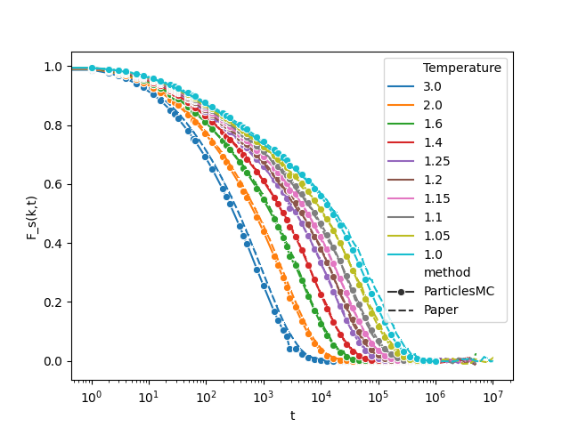

# Simulation of ortho-terphenyl (MC swap between atoms of the same molecule)

In this example, we simulate 1000 molecules of ortho-terphenyl (modeled as molecules containing three particles) at a number density of 1.2, for multiple temperatures.
This mirrors what was done in the publication [Molecular motion at the experimental glass transition](https://doi.org/10.1103/4twk-33j7).

In every case, we will run MC simulations that have swap moves between atoms of the same molecule.

This example is split into multiple steps:

## 1. Create a configuration at the correct density

We want to run our simulations at a relatively high density.

The easiest way to create a decent starting point is to first generate a structure at a low density (we can put molecules on a simple lattice, all in the same orientation), and slowly increase the density until we reach the desired one.
This density increase is done by running multiple consecutive simulations, downscaling the simulation box between each simulation.

The scripts to do this are in the [1-create-config-right-density](./1-create-config-right-density) subfolder. The process is to first run the python script, preferably using [uv](https://doi.org/10.1103/4twk-33j7). then the run.sh script, which will run the MC simulations.

## 2 - Create equilibrated configurations at various temperatures

The configuration generated at the previous step needs to be further equilibrated if we want representative starting points for production runs at different temperatures.

The next step is therefore to run long simulations, one for each target temperature, to produce inputs for the production runs.

This is done by running the bash script in the [2-equilibrate-at-different-temperatures](./2-equilibrate-at-different-temperatures) subfolder.

## 3 - Run production simulations

For each of the temperature, we run a long simulation to accumulate data, sung the bash script in the [3-run-production](./3-run-production) subfolder.

## 4 - Analyze results

Many analyses could be done. Here we look at a single time correlation function as an example. It corresponds to Fig. 4a of the paper listed above.

The correlation function is computed using an external python package, [atooms-pp](https://framagit.org/atooms/postprocessing).
The results are compared to the published results, to obtain the following plot

There is a very good agreement between two sets of results. As these are MC simulations, the time has no proper physical meaning, and changing MC parameters (like amplitude of displacements, ratio between types of moves) will affect the time scales. So actual quantitative comparison can't be done.
