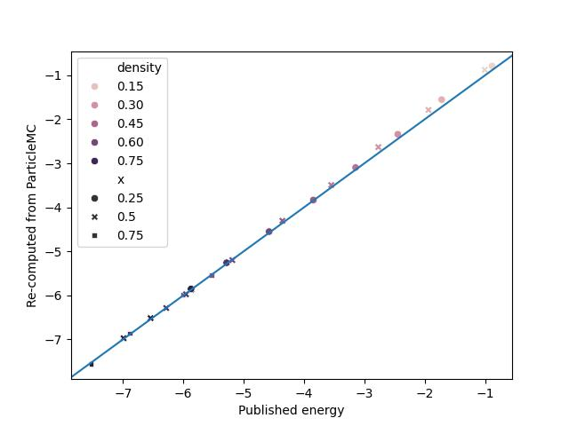

# Binary mixture of LJ particles

This directory contains scripts to run a simple simulation of a binary mixture of Lennard-Jones particles, in 3D.

The average energy is recorded, for different conditions (temperature, density, ratio between the two species), and compared to published results.

Reproducing the published results validates the implementation of the MC scheme, the LJ potential, and interaction counting.

## How to run

The `particlemc` exectuable should be in the PATH env variable, otherwise a specific path can
be specified at the top of the run-validation.py script.

The `run-validation.py` script is meant to be run with [uv](https://docs.astral.sh/uv/), with the following command:
```bash
uv run --script run-validation.py
```
which automatically install all dependencies.

The script will run simulations at all desired parameters, save the results to csv, and make a correlation plot with published results.

## Results

ParticleMC reproduces published results very well:




On this plot, `x` is the ratio between the two types of particles, and the energy is per particle.

For some setups, the energies from ParticleMC are a bit higher than published ones. This actually happens at low density, because the simulation times are too short and we don't reach proper convergence (timeseries of energies not shown).

## Reference data
Comes from Monte Carlo Simulations of Binary Lennard–Jones Mixtures: A Test of the van der Waals One-Fluid Model, https://doi.org/10.1023/A:1022614200488
